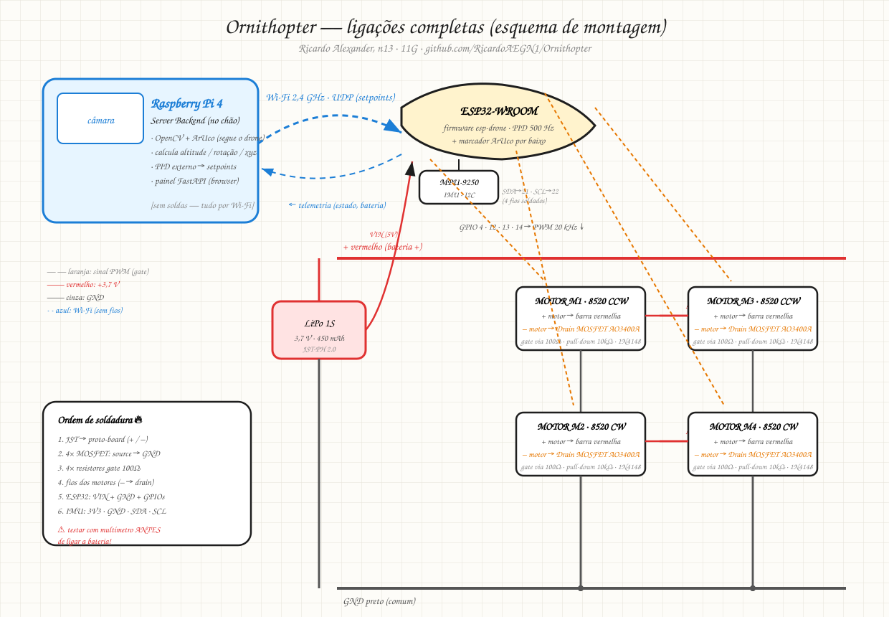

# 🚁 ORNITHOPTER

> Drone quadcóptero estilo **Dune** (thopter), controlado por **ESP32** com firmware open-source **ESP-Drone** (Espressif). Projeto escolar de eletrónica — construído componente a componente, sem kits.

**📖 Site do projeto (GitHub Pages):** https://ricardoaegn1.github.io/Ornithopter/ — apresentação, BOM interativo e todos os docs.

## Esquema de ligações (visão geral)



*Raspberry Pi (estação de solo, sem soldas) → Wi-Fi → ESP32 no drone → 4 motores com MOSFETs + IMU. Ordem de soldadura e legenda no diagrama; detalhes em [`docs/wiring.md`](docs/wiring.md) e [`docs/ground-station.md`](docs/ground-station.md).*

## Números-chave

| Métrica | Valor |
|---|---|
| Peso total (AF) | ~78 g |
| Empuxo | ~150 g (razão 2,0×) |
| Autonomia | 6–11 min |
| Custo total | **44,30 €** (orçamento 70 €) |
| Loop de controlo | PID 500 Hz |
| Controlo | App iOS/Android via Wi-Fi 2,4 GHz |

## Estrutura

```
docs/               Viabilidade, BOM (CSV p/ Excel), pinout, plano de construção
cad/                Modelo paramétrico OpenSCAD (frame + carenagem estilo Dune)
presentation/       Apresentação HTML do projeto (abrir no browser)
ground-station/     Estação de solo em Raspberry Pi (visão + controlo autónomo)
assets/             Esquema à mão do criador + diagrama de ligações SVG
tools/              build_site.py — gera o site do GitHub Pages
site/               (gerado) site estático publicado no Pages
```

> O site (`site/`) é gerado automaticamente por `.github/workflows/pages.yml` a cada push para `main`.

## Arquitetura (v2 — autonomia)

```
Telemóvel/PC ──► Raspberry Pi (câmara + OpenCV) ──UDP/CRTP──► ESP32 ──► 4 motores
      painel         seguimento ArUco · altitude ·       PID interno · mixer
                     rotação · velocidades/direção       (firmware esp-drone)
```

O drone leva um marcador ArUco; a RPi calcula posição/altitude/rotação por visão e envia
setpoints — ver [`docs/ground-station.md`](docs/ground-station.md).

## Documentos

- [`docs/viability.md`](docs/viability.md) — estudo de viabilidade (arquitetura, empuxo/peso, potência, estabilidade)
- [`docs/bom.md`](docs/bom.md) — lista de materiais com fornecedores e custos
- [`docs/bom.csv`](docs/bom.csv) — mesma lista em CSV (abre no Excel com colunas certas)
- [`docs/ground-station.md`](docs/ground-station.md) — estação de solo RPi: visão, controlo, segurança
- [`ground-station/main.py`](ground-station/main.py) — skeleton executável (FastAPI + OpenCV)
- [`docs/wiring.md`](docs/wiring.md) — pinout ESP32 e esquema de ligações
- [`docs/build-plan.md`](docs/build-plan.md) — plano de construção em blocos com critérios de passe
- [`cad/ornithopter.scad`](cad/ornithopter.scad) — CAD paramétrico (OpenSCAD → STL)
- [`presentation/ornithopter.html`](presentation/ornithopter.html) — apresentação do projeto

## Stack

| Camada | Tecnologia |
|---|---|
| Flight controller | ESP32-WROOM-32 (escola) |
| Firmware | [espressif/esp-drone](https://github.com/espressif/esp-drone) (ESP-IDF v5.0, GPL-3.0) |
| IMU | MPU-9250 (I2C) |
| Motores | 4× coreless 8520 + MOSFET AO3400A |
| Bateria | LiPo 1S 450 mAh 25C |
| App | [ESP-Drone-Android](https://github.com/EspressifApps/esp-drone-android) / iOS |
| Estação de solo | Raspberry Pi 4 + OpenCV (ArUco) · FastAPI |
| CAD | OpenSCAD |

*"The spice must flow."* 🕌
